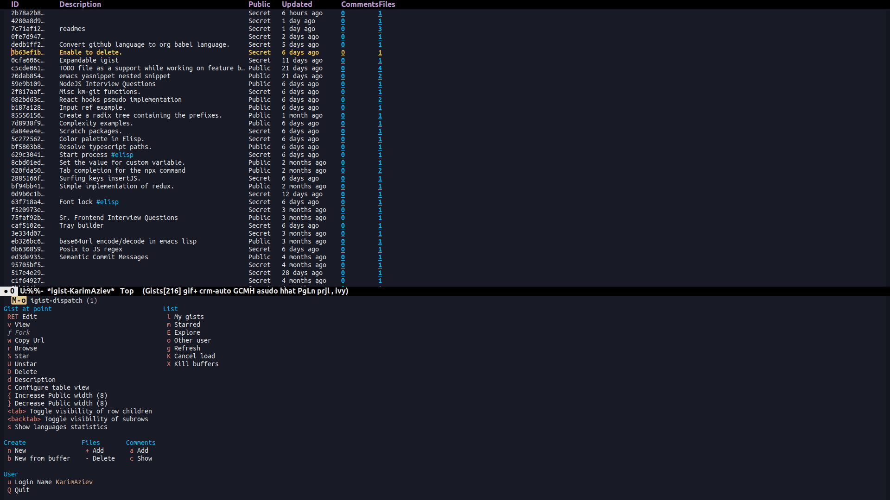

[](https://melpa.org/#/igist)

# About

The Emacs everywhere goal continues. These are the main features of
`igist` to help you never leave Emacs to manage your gists.


## Features

### Gists

  - \[X\] create
  - \[X\] edit
  - \[X\] delete
  - \[X\] star
  - \[X\] unstar
  - \[X\] fork
  - \[X\] list
  - \[X\] explore public gists

### Comments

  - \[X\] add
  - \[X\] list
  - \[X\] delete
  - \[X\] edit

# igist

>   - [About](#about)
>       - [Features](#features)
>           - [Gists](#gists)
>           - [Comments](#comments)
>       - [Requirements](#requirements)
>       - [Installation](#installation)
>           - [MELPA](#melpa)
>           - [Manually](#manually)
>           - [With `use-package`](#with-use-package)
>       - [Auth](#auth)
>           - [Secure](#secure)
>           - [Insecure](#insecure)
>       - [Usage](#usage)
>           - [General](#general)
>           - [List gists](#list-gists)
>           - [Table](#table)
>           - [Minibuffer Completions](#minibuffer-completions)
>           - [Edit gist](#edit-gist)
>           - [List comments](#list-comments)
>           - [Editing comment](#editing-comment)

## Requirements

  - Emacs \>= 27.1
  - ghub
  - transient
  - [Github API
    token](https://magit.vc/manual/forge/Token-Creation.html#Token-Creation)

## Installation

### MELPA

`igist` is available on [MELPA](https://melpa.org/#/).

To get started, enable installing packages from MELPA:

``` elisp
(require 'package)
(add-to-list 'package-archives '("melpa" . "https://melpa.org/packages/") t)
(package-initialize)

```

To fetch the list of packages you can do:

``` example
<M-x> package-refresh-contents
```

And after that `igist` can be installed with:

``` example
<M-x> package-install igist
```

### Manually

Download the repository and it to your load path in your init file:

``` elisp
(add-to-list 'load-path "/path/to/igist")
(require 'igist)
```

### With `use-package`

``` elisp
(use-package igist
  :bind (("M-o" . igist-dispatch)))
```

Or if you use `straight.el`:

``` elisp
(use-package igist
  :bind (("M-o" . igist-dispatch))
  :straight (igist
             :repo "KarimAziev/igist"
             :type git
             :host github))
```


<details>
  <summary>Example configuration with keymaps</summary>

```elisp
(use-package igist
  :bind (("M-o" . igist-dispatch)
         (:map igist-list-mode-map
               ("C-j" . igist-list-view-current)
               ("RET" . igist-list-edit-gist-at-point)
               ("+" . igist-list-add-file)
               ("-" . igist-delete-current-filename)
               ("D" . igist-delete-current-gist)
               ("S" . igist-star-gist)
               ("U" . igist-unstar-gist)
               ("a" . igist-add-comment)
               ("c" . igist-load-comments)
               ("d" . igist-list-edit-description)
               ("f" . igist-fork-gist)
               ("g" . igist-list-refresh)
               ("r" . igist-browse-gist)
               ("s" . igist-tabulated-list-sort)
               ("v" . igist-list-view-current)
               ("w" . igist-copy-gist-url)
               ("K" . igist-list-cancel-load)
               ("{" . igist-tabulated-list-narrow-current-column)
               ("}" . igist-tabulated-list-widen-current-column)
               ("<tab>" . igist-toggle-row-children-at-point)
               ("<backtab>" . igist-toggle-all-children)
               ("C" . igist-table-menu))
         (:map igist-edit-mode-map
               ([remap save-buffer] . igist-save-current-gist)
               ("M-o" . igist-dispatch)
               ("C-c C-c" . igist-save-current-gist-and-exit)
               ("C-c C-k" . kill-current-buffer)
               ("C-c '" . igist-save-current-gist-and-exit))
         (:map igist-comments-list-mode-map
               ("+" . igist-add-comment)
               ("-" . igist-delete-comment-at-point)
               ("D" . igist-delete-comment-at-point)
               ("e" . igist-add-or-edit-comment)
               ("g" . igist-load-comments)
               ("q" . kill-current-buffer))
         (:map igist-comments-edit-mode-map
               ("M-o" . igist-dispatch)
               ("C-c C-c" . igist-post-comment)
               ("C-c C-k" . kill-current-buffer))))
```
</details>

## Auth

You need to ensure that you have [a GitHub API
token](https://github.com/settings/tokens) with scope `gist`. Then there
are two options to feed it.

### Secure

To use `auth-sources`, you need to add a such entry with a Github
username and token, e.g.:

``` example
machine api.github.com login MY_GITHUB_USERNAME^igist password MY_GITHUB_TOKEN
```

Replace MY\_GITHUB\_USERNAME with your actual GitHub username and
MY\_GITHUB\_TOKEN with the token.

To use other suffixes instead of `^igist` (`M-x customize-variable`
`RET` and type `igist-auth-marker`).

You can read more in
[ghub](https://magit.vc/manual/forge/Token-Creation.html#Token-Creation)
manual, as igist relies on the provided API.

### Insecure

If the value of the variable `igist-auth-marker` is a string, it will be
used as a token.


<details>
  <summary>Show example</summary>

```elisp
(use-package igist
  :init (setq-default igist-ask-for-description 'never)
  :config
  (unless igist-current-user-name
    (let ((default-directory user-emacs-directory))
      (condition-case nil
          (progn (setq igist-current-user-name
                       (car-safe
                        (process-lines "git"
                                       "config"
                                       "user.name")))
                 (setq igist-auth-marker
                       (or (ignore-errors
                             (car-safe (process-lines "git" "config"
                                                      "github.oauth-token")))
                           igist-auth-marker)))
        (error (message "Igist-current-user-name cannot setted"))))))
```
</details>

## Usage

### General

The simplest way is to invoke a transient popup with the list of
available commands for the current buffer:

  - `M-x igist-dispatch` - in `igists` buffers it is bound to `M-o`.

### List gists

There are two ways in which gists can be presented - as a table or as
minibuffer completions.

### Table

  - `M-x igist-list-gists` - to display gists of logged GitHub user.

  - `M-x igist-explore-public-gists` - list public gists sorted by most
    recently updated to least recently updated.
    [](./igist-explore-demo.png)

  - `M-x igist-list-other-user-gists` - to display public gists of
    non-logged user.

This commands render and load gists with pagination. To stop or pause
loading use command `igist-list-cancel-load` (default keybinding is
`K`).

| Key         | Command                                  |
| ----------- | ---------------------------------------- |
| `RET`       | edit gist                                |
| `C-j`       | view gist                                |
| `v`         | view gist                                |
| `+`         | add file to the gist                     |
| `-`         | delete file from gist                    |
| `D`         | delete the whole gist                    |
| `K`         | stop loading                             |
| `S`         | start gist                               |
| `U`         | unstar gist                              |
| `a`         | comment gist                             |
| `c`         | show comments                            |
| `d`         | edit gist description                    |
| `f`         | fork gist                                |
| `g`         | refresh gists                            |
| `r`         | browse gist                              |
| `s`         | sort gists                               |
| `w`         | copy gist url                            |
| `{`         | narrow current gist column               |
| `}`         | widen current gist column                |
| `<tab>`     | toggle visibility of gist files at point |
| `<backtab>` | toggle visibility of all files           |
| `C`         | configure and save view settings         |

To customize these keys, see the variable `igist-list-mode-map`.

You can configure and save width of each column interactivelly with
transient menu - `igist-table-menu`.

[](./igist-demo-view.gif).

To configure which columns to display in user's buffer customize
variable `igist-explore-format` and for explore buffers -
`igist-explore-format`.

### Minibuffer Completions

  - `M-x igist-edit-list` - read Gist to edit from the minibuffer.

Ivy users can also use `igist-ivy-read-public-gists` and
`igist-ivy-read-user-gists`.

### Edit gist

You can view, edit and save gists in buffers with `igist-edit-mode`.
This minor mode is turned on after command `igist-edit-gist` and
`igist-edit-list`.

| Key       | Command              |
| --------- | -------------------- |
| `M-o`     | transient popup      |
| `C-c C-c` | save and exit        |
| `C-c '`   | save and exit        |
| `C-x C-s` | save without exiting |

To customize these keys see the variable `igist-edit-mode-map`.

### List comments

This minor mode is turned on after command `igist-load-comments`.

In comments list mode, such commands are available:

| Key | Command                     |
| --- | --------------------------- |
| `+` | add comment                 |
| `-` | delete the comment at point |
| `D` | delete the comment at point |
| `e` | add or edit                 |
| `g` | refresh comments            |

To customize these keybindings edit the variable
`igist-comments-list-mode-map`.

### Editing comment

This minor mode is turned on after commands `igist-edit-comment` and
`igist-add-comment`. Keymap for posting and editing comments:

| Key       | Command      |
| --------- | ------------ |
| `C-c C-c` | post comment |

To customize these keybindings edit the variable
`igist-comments-edit-mode-map`.
