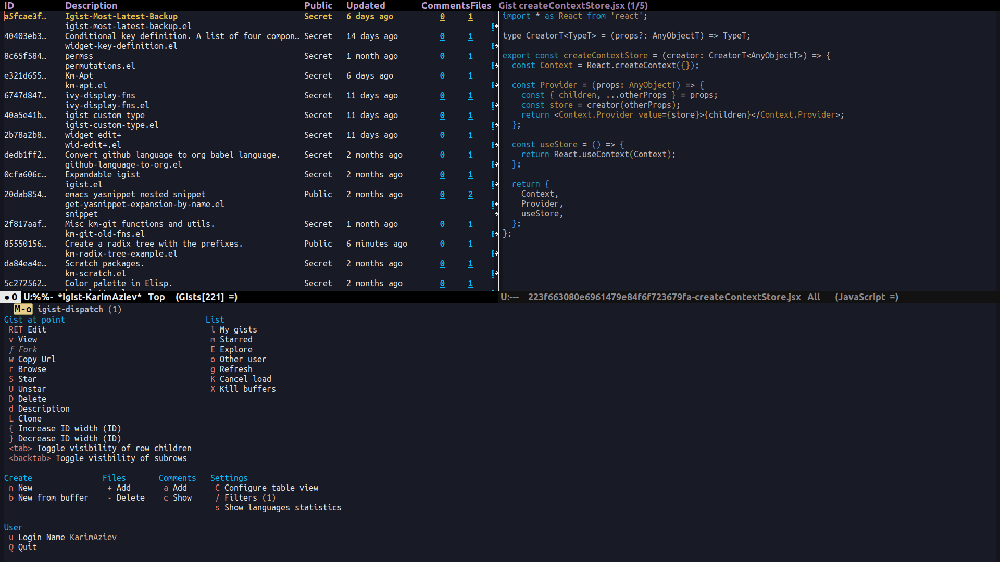

[](https://melpa.org/#/igist)

# About

The Emacs everywhere goal continues. These are the main features of
`igist` to help you never leave Emacs to manage your gists.



## Features

### Gists

- \[X\] create
- \[X\] edit
- \[X\] delete
- \[X\] star
- \[X\] unstar
- \[X\] fork
- \[X\] list
- \[X\] explore public gists

### Comments

- \[X\] add
- \[X\] list
- \[X\] delete
- \[X\] edit

# igist

> - [About](#about)
>   - [Features](#features)
>     - [Gists](#gists)
>     - [Comments](#comments)
>   - [Requirements](#requirements)
>   - [Installation](#installation)
>     - [MELPA](#melpa)
>     - [Manually](#manually)
>     - [With `use-package`](#with-use-package)
>   - [Auth](#auth)
>     - [Setting Up token](#setting-up-token)
>     - [Secure Way: Using
>       auth-sources](#secure-way-using-auth-sources)
>     - [Insecure way](#insecure-way)
>   - [Usage](#usage)
>     - [List gists](#list-gists)
>     - [Table](#table)
>     - [Minibuffer Completions](#minibuffer-completions)
>     - [Edit gist](#edit-gist)
>     - [List comments](#list-comments)
>     - [Editing comment](#editing-comment)
>   - [Customization](#customization)

## Requirements

- Emacs \>= 27.1
- ghub
- transient
- [Github API
  token](https://magit.vc/manual/forge/Token-Creation.html#Token-Creation)

## Installation

### MELPA

`igist` is available on [MELPA](https://melpa.org/#/).

To get started, enable installing packages from MELPA:

```elisp
(require 'package)
(add-to-list 'package-archives '("melpa" . "https://melpa.org/packages/") t)
(package-initialize)

```

To fetch the list of packages you can do:

```example
<M-x> package-refresh-contents
```

And after that `igist` can be installed with:

```example
<M-x> package-install igist
```

### Manually

Download the repository and it to your load path in your init file:

```elisp
(add-to-list 'load-path "/path/to/igist")
(require 'igist)
```

### With `use-package`

```elisp
(use-package igist
  :bind (("M-o" . igist-dispatch)))
```

Or if you use `straight.el`:

```elisp
(use-package igist
  :bind (("M-o" . igist-dispatch))
  :straight (igist
             :repo "KarimAziev/igist"
             :type git
             :host github))
```

<details>
  <summary>Example configuration with keymaps</summary>

```elisp
(use-package igist
  :bind (("M-o" . igist-dispatch)
         (:map igist-list-mode-map
               ("C-j" . igist-list-view-current)
               ("RET" . igist-list-edit-gist-at-point)
               ("+" . igist-list-add-file)
               ("-" . igist-delete-current-filename)
               ("D" . igist-delete-current-gist)
               ("S" . igist-star-gist)
               ("U" . igist-unstar-gist)
               ("a" . igist-add-comment)
               ("c" . igist-load-comments)
               ("d" . igist-list-edit-description)
               ("f" . igist-fork-gist)
               ("g" . igist-list-refresh)
               ("r" . igist-browse-gist)
               ("s" . igist-tabulated-list-sort)
               ("v" . igist-list-view-current)
               ("w" . igist-copy-gist-url)
               ("K" . igist-list-cancel-load)
               ("{" . igist-tabulated-list-narrow-current-column)
               ("}" . igist-tabulated-list-widen-current-column)
               ("<tab>" . igist-toggle-row-children-at-point)
               ("<backtab>" . igist-toggle-all-children)
               ("C" . igist-table-menu))
         (:map igist-edit-mode-map
               ([remap save-buffer] . igist-save-current-gist)
               ("M-o" . igist-dispatch)
               ("C-c C-c" . igist-save-current-gist-and-exit)
               ("C-c C-k" . kill-current-buffer)
               ("C-c '" . igist-save-current-gist-and-exit))
         (:map igist-comments-list-mode-map
               ("+" . igist-add-comment)
               ("-" . igist-delete-comment-at-point)
               ("D" . igist-delete-comment-at-point)
               ("e" . igist-add-or-edit-comment)
               ("g" . igist-load-comments)
               ("q" . kill-current-buffer))
         (:map igist-comments-edit-mode-map
               ("M-o" . igist-dispatch)
               ("C-c C-c" . igist-post-comment)
               ("C-c C-k" . kill-current-buffer))))
```

</details>

## Auth

`igist` manages authentication through two customizable variables:

- `igist-current-user-name`: This variable should be set to a string
  containing your GitHub username.
- `igist-auth-marker`: This variable can either be a string containing
  the OAuth token or a symbol indicating where to fetch the OAuth
  token.

### Setting Up token

Firsly, you need to ensure that you have [a GitHub API
token](https://github.com/settings/tokens) with scope `gist`:

1.  Log in to your GitHub account and navigate to settings.
2.  Select the Developer settings option on the bottom of the sidebar.
3.  Here you'll see a Personal access tokens section, click on it.
4.  Click on "Generate new token", give your token a descriptive name.
5.  Ensure the "gist" scope is checked, this will give igist the
    necessary permissions it needs to manage your gists.
6.  Click on Generate token at the bottom of the page. Be sure to copy
    your new personal access token now as you cannot see it again.

After getting your token, you can supply it to `igist` in one of two
ways.

### Secure Way: Using auth-sources

Emacs `auth-sources` provide a secure way to store your GitHub username
and OAuth token.

To employ this method, set `igist-auth-marker` to the symbol `igist`:

```elisp
(setq igist-auth-marker 'igist)
```

Next, add an entry to your `auth-sources`:

```plaintext
machine api.github.com login YOUR-GITHUB-USERNAME^igist password YOUR-GITHUB-TOKEN
```

You can add this entry to your `~/.authinfo.gpg` file (recommended for
secure, encrypted storage) or `~/.authinfo` (see variable
`auth-sources`).

You can read more in
[ghub](https://magit.vc/manual/forge/Token-Creation.html#Token-Creation)
manual, as igist relies on the provided API.

### Insecure way

While not recommended due to security issues, you can set
`igist-auth-marker` and `igist-current-user-name` in your Emacs config
file:

```elisp
(setq igist-current-user-name "your-github-username")
(setq igist-auth-marker "your-github-oauth-token")
```

<details>
  <summary>Another example</summary>

```elisp
(use-package igist
  :init (setq-default igist-ask-for-description 'never)
  :config
  (let ((default-directory user-emacs-directory))
      (condition-case nil
          (progn (setq igist-current-user-name
                       (car-safe
                        (process-lines "git"
                                       "config"
                                       "user.name")))
                 (setq igist-auth-marker
                       (or (ignore-errors
                             (car-safe (process-lines "git" "config"
                                                      "github.oauth-token")))
                           igist-auth-marker)))
        (error (message "Igist-current-user-name cannot setted")))))
```

</details>

**Note**: In this method, your OAuth token will be stored as plain text
in your emacs config file, which is insecure. Ensure your config file
permissions are appropriately set to prevent unauthorized access.

## Usage

With the authentication properly configured, you can now use `igist`.
The simplest way is to invoke a transient popup with the list of
available commands for the current buffer:

- `M-x igist-dispatch` - in `igists` buffers it is bound to `M-o`.

### List gists

There are two ways in which gists can be presented - as a table or as
minibuffer completions.

### Table

- `M-x igist-list-gists` - to display gists of logged GitHub user.

- `M-x igist-explore-public-gists` - list public gists sorted by most
  recently updated to least recently updated.
  [](./igist-explore-demo.png)

- `M-x igist-list-other-user-gists` - to display public gists of
  non-logged user.

This commands render and load gists with pagination. To stop or pause
loading use command `igist-list-cancel-load` (default keybinding is
`K`).

**Gists Actions**

| Key          | Description           | Command                         |
| ------------ | --------------------- | ------------------------------- |
| `RET`        | edit gist             | `igist-list-edit-gist-at-point` |
| `v` or `C-j` | view gist             | `igist-list-view-current`       |
| `+`          | add file to the gist  | `igist-list-add-file`           |
| `-`          | delete file from gist | `igist-delete-current-filename` |
| `D`          | delete the whole gist | `igist-delete-current-gist`     |
| `K`          | stop loading          | `igist-list-cancel-load`        |
| `S`          | star gist             | `igist-star-gist`               |
| `U`          | unstar gist           | `igist-unstar-gist`             |
| `a`          | comment gist          | `igist-add-comment`             |
| `c`          | show comment          | `igist-load-comments`           |
| `d`          | edit description      | `igist-list-edit-description`   |
| `f`          | fork gist             | `igist-fork-gist`               |
| `g`          | refresh gists         | `igist-list-refresh`            |
| `r`          | browse gist           | `igist-browse-gist`             |
| `s`          | sort gist             | `igist-tabulated-list-sort`     |
| `w`          | copy gist url         | `igist-copy-gist-url`           |

**UI Actions**

| Key            | Description                         | Command                                      |
| -------------- | ----------------------------------- | -------------------------------------------- |
| `C`            | open transient menu for editing UI  | `igist-table-menu`                           |
| `<tab>`        | toggle visibility of files at point | `igist-toggle-row-children-at-point`         |
| `<backtab>`    | toggle visibility of all files      | `igist-toggle-all-children`                  |
| `{`            | widen current gist column           | `igist-tabulated-list-widen-current-column`  |
| `}`            | narrow current gist column          | `igist-tabulated-list-narrow-current-column` |
| `M-]` or `M-}` | swap column with the next one       | `igist-swap-current-column`                  |
| `M-[` or `M-{` | swap column with the previous one   | `igist-swap-current-column-backward`         |
|                |                                     |                                              |

You can change the width, reorder, or remove columns interactively with
the transient menu - `igist-table-menu`. If you want to save your
settings, use the command `M-x igist-save-column-settings`. To discard,
use `M-x igist-reset-columns-settings`.

[](./igist-demo-view.gif)

To customize these keys, see the variable `igist-list-mode-map`.

### Minibuffer Completions

- `M-x igist-edit-list` - read Gist to edit from the minibuffer.

Ivy users can also use `igist-ivy-read-public-gists` and
`igist-ivy-read-user-gists`.

### Edit gist

You can view, edit and save gists in buffers with `igist-edit-mode`.
This minor mode is turned on after command `igist-edit-gist` and
`igist-edit-list`.

| Key       | Command              |
| --------- | -------------------- |
| `M-o`     | transient popup      |
| `C-c C-c` | save and exit        |
| `C-c '`   | save and exit        |
| `C-x C-s` | save without exiting |

To customize these keys see the variable `igist-edit-mode-map`.

### List comments

This minor mode is turned on after command `igist-load-comments`.

In comments list mode, such commands are available:

| Key | Command                     |
| --- | --------------------------- |
| `+` | add comment                 |
| `-` | delete the comment at point |
| `D` | delete the comment at point |
| `e` | add or edit                 |
| `g` | refresh comments            |

To customize these keybindings edit the variable
`igist-comments-list-mode-map`.

### Editing comment

This minor mode is turned on after commands `igist-edit-comment` and
`igist-add-comment`. Keymap for posting and editing comments:

| Key       | Command      |
| --------- | ------------ |
| `C-c C-c` | post comment |

To customize these keybindings edit the variable
`igist-comments-edit-mode-map`.

## Customization

- `igist-current-user-name`: This variable should be set to a string
  that contains your GitHub username.
- `igist-auth-marker`: This variable can either be a string that
  contains the OAuth token or a symbol indicating where to retrieve
  the OAuth token.
- `igist-message-function`: A custom function for displaying messages.
  Should accept the same arguments as the `message` function.
- `igist-per-page-limit`: The number of results displayed per page
  should be a value ranging between 30 to 100. The default value is 30.
- `igist-ask-for-description`: Determines when to prompt for a
  description before posting new gists. The default setting prompts
  for a description before saving a new gist.
- `igist-enable-copy-gist-url-p`: Specifies whether and when to add
  the URL of a new or updated gist to the kill ring. The default
  setting is after the creation of new gists.
- `igist-list-format`: Specifies the format of the user's Tabulated
  Gists buffers.
- `igist-explore-format`: Specifies the format of the Explore Public
  Gists tabulated buffers.
